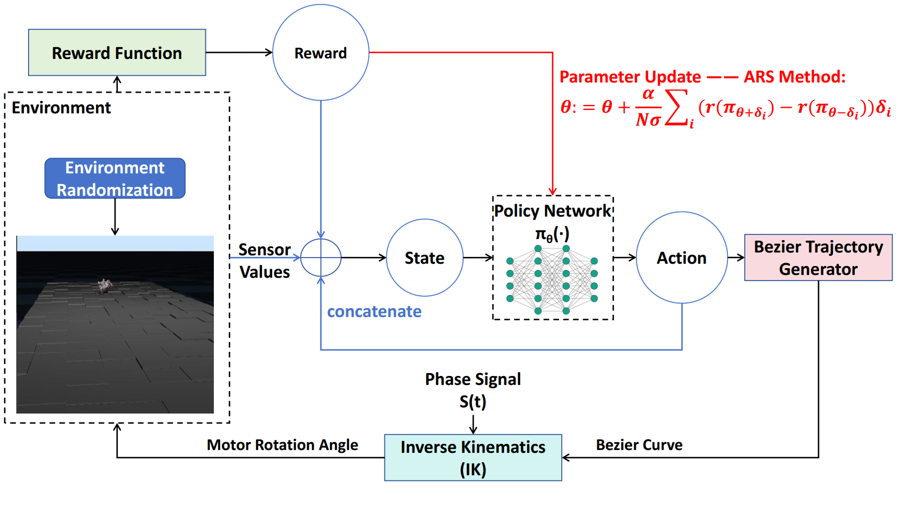

# ARS-Bezier

**Article:** ARS-Bezier: A Trajectory-based Reinforcement Learning Approach for Autonomous Locomotion of a Rat Robot (under way)

**Experiment Platformat:** Robot Rat NeRmo & MuJoCo





## Train

To train the model, use the following command. You can also use `--help` to find useful parameters such as the learning rate.

If you want to train the model in a given scenario, use the command:

```
python train.py --modelPath <environment path>
```

If you want to try our environment randomization method, use:

```
python train.py --rand_env
```

Here are some hyperparameters:

`--max_steps`: maximum steps in each round.

`--max_epoch`: total training epochs.

`--episode_num`: amount of randomly sampled points in each epoch.

`--max_epoch`: top-k episodes in each epoch are used to update parameters.

`--learning_rate`: learning rate.

`--exploration_noise`: sampling range.


## Eval

To evaluate the model in a specific scenario, use the command:

```bash
python eval.py --modelPath <environment path> --parameterPath <parameter path>
```


