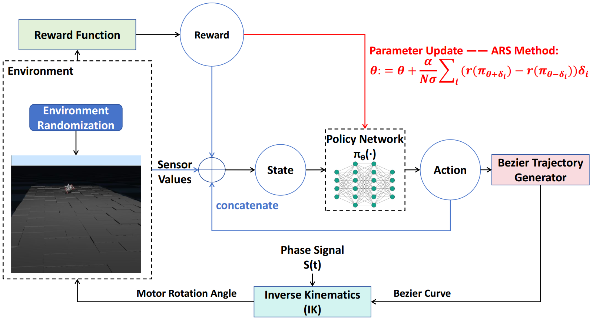

# ARS-Bezier

**Article:** Zijian Zhao, Zitao Zhang, Kai Huang, "[A Trajectory-based Reinforcement Learning Approach for Autonomous Locomotion of a Rat Robot](https://github.com/RS2002/ARS-Bezier/blob/main/ARS_Bezier.pdf)"

**Experiment Platform:** Robot Rat NeRmo & MuJoCo

Conference Version of [RS2002/RL-Rat: Repository for Final Design, "Motion Control Method for Small Quadruped Robots Based on Trajectory Modulation and Reinforcement Learning" (基于轨迹调制和强化学习的小型四足机器人运动控制方法)](https://github.com/RS2002/RL-Rat).




## 1. Train

To train the model, use the following command. You can also use `--help` to find useful parameters such as the learning rate.

If you want to train the model in a given scenario, use the command:

```
python train.py --modelPath <environment path>
```

If you want to try our environment randomization method, use:

```
python train.py --rand_env
```

Here are some hyper-parameters:

`--max_steps`: maximum steps in each round.

`--max_epoch`: total training epochs.

`--episode_num`: amount of randomly sampled points in each epoch.

`--max_epoch`: top-k episodes in each epoch are used to update parameters.

`--learning_rate`: learning rate.

`--exploration_noise`: sampling range.


## 2. Eval

To evaluate the model in a specific scenario, use the command:

```bash
python eval.py --modelPath <environment path> --parameterPath <parameter path>
```


## 3. Citation

```
@misc{zhao2024ARS,
  title={A Trajectory-based Reinforcement Learning Approach for Autonomous Locomotion of a Rat Robot},
  author={Zijian Zhao and Zitao Zhang and Kai Huang},
  year={2024},
  howpublished={\url{https://github.com/RS2002/ARS-Bezier/blob/main/ARS_Bezier.pdf}},
  note={Github Blog}
}
```

